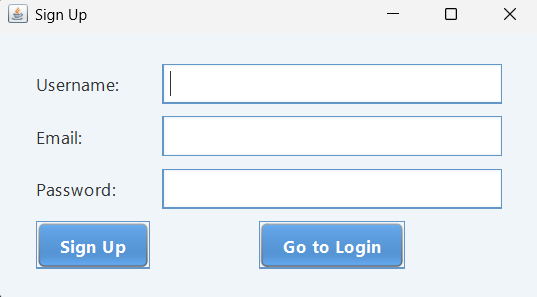
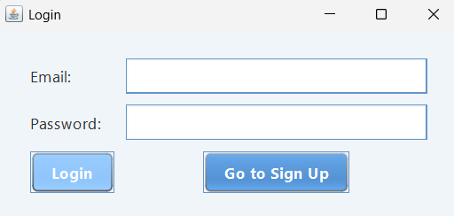
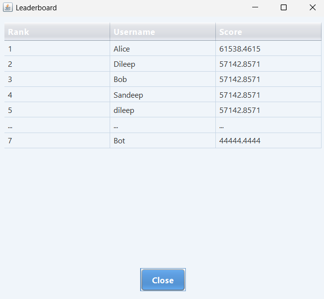

<h1 align="center">Memory Boost Game 🎮</h1>

## Overview
This Java-based Memory Boost Game project is a comprehensive desktop application that combines a classic memory-matching card game with user authentication and leaderboard functionalities. Built using Java Swing for the GUI and SQLite for data persistence, the application features user registration/login systems, a theme-based memory game (with cricket, IPL, and anime options), dynamic score calculation based on efficiency, and a leaderboard displaying top players alongside the current user's rank. The game mechanics include card flipping animations, move tracking, and score calculation formulas that reward fewer moves, while the database integration handles user credentials storage, score updates, and leaderboard queries. The interface utilizes custom styling with consistent color schemes and fonts, featuring responsive buttons, grid-based card layouts, and proper error handling throughout the authentication and gameplay processes.

### SignUp
 

### Login
 

### Theme Selection
 

### Game UI
 

### Leaderboard 
 

### Database Schema 
 


## Setup Steps

### 1. Clone the Repository

```bash
git clone https://github.com/DileepGhanta/Memory-Boost-Game.git
```

### 2. Install SQLite

Refer to [this guide for SQLite Installation](https://docs.google.com/document/d/1QI-S8keazW8rkgmco5U-mdDQhbLZPsCRrIu7C9udyr4/edit?usp=sharing).

### 3. Update Database Path

Before running the project, update your database path in the `MainApp.java` file:
- **Step 1**: Inside the `SQLDB` class
- **Step 2**: Inside the `loadLeaderboardData` method

### 4. Compile the Project

```bash
javac MainApp.java
```

### 5. Run the Project

```bash
java -cp "D:\Java\Java-Project\sqlite-jdbc-3.49.1.0.jar;." MainApp
```